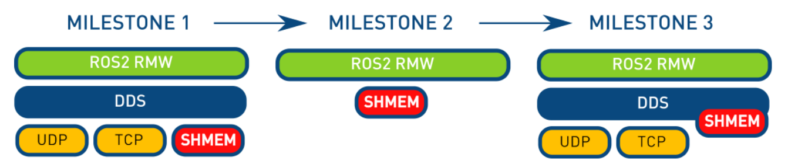
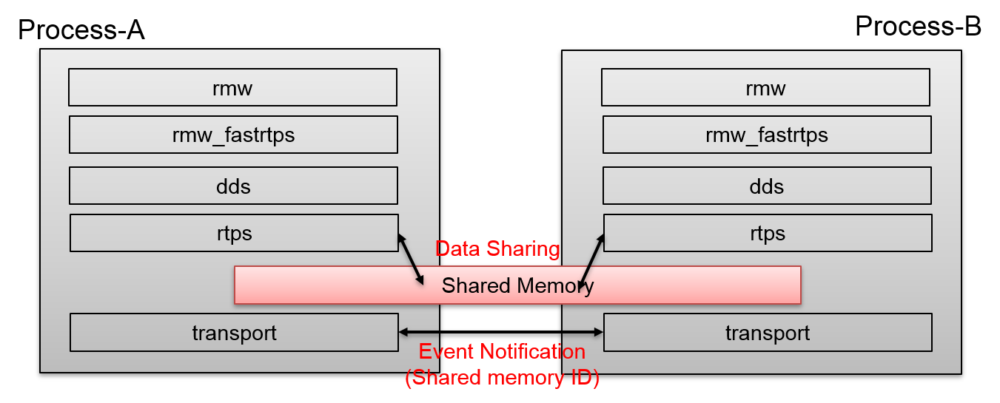
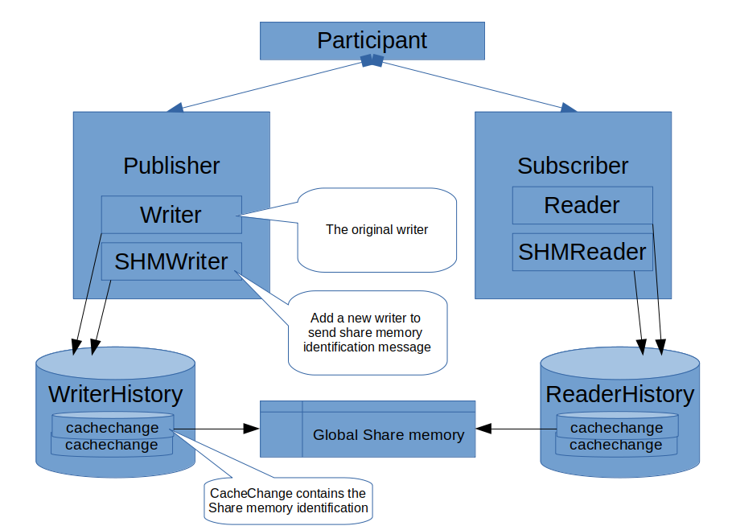

# draft of data sharing for MS3 {ignore=true}

## Content {ignore=true}
<!-- @import "[TOC]" {cmd="toc" depthFrom=1 depthTo=3 orderedList=false} -->

<!-- code_chunk_output -->

- [Overview](#overview)
- [Consideration](#consideration)
  - [MS1](#ms1)
  - [MS2](#ms2)
  - [MS3](#ms3)
- [Basic Design](#basic-design)
  - [publisher](#publisher)
  - [subscriber](#subscriber)
  - [sequence](#sequence)
- [Implementation](#implementation)
- [Event notification](#event-notification)
- [Issues](#issues)
- [Reference](#reference)

<!-- /code_chunk_output -->


## Overview

After eProsima finished the share memory transport for the milestone 1 of FastRTPS, we found there is a big latency improvement for transporting data by comparing UDP with SHM. But it seems that we can utilize the maximum improvement of share memory by using HugeTLB and transform the share memory from transport level up to writer level in the RTPS. About milestone 2, it needs a lot of work to re-create the whole sharing data framework, such as QoS or event notification. We don't want to revent the wheel at the moment, this documents focuses on the feasibility of share memory in the milestone 3.

## Consideration



### MS1

In a shot, publishing message data of a topic is to create one existing writer(StatefulWriter, StatelessWriter) with multiple transports (UDP, SHM)

### MS2

Ignore it.

### MS3



SHMEM isn't located at the same layer like UDP and TCP. That is, not to use the share memory transport implemented at the milestone 1. At milestone 3, found that maybe we can utilize the DDS CacheChange by storing share memory data, and create a new RTPSWriter(StatefulWriter) with a specific topic to notify events with the share memory identification message to implement this data sharing feature.




NOTE: use boost::basic_managed_mapped_file to encapsulate the shm operation so that we can utilize the HugeTLB feature on Linux.

## Basic Design

Consider a basic use case as follows,


### publisher

```
        publishing message data by creating a cache change to store data(Not only for serialized data, but for raw data).
                raw(It's for the same DDS that we can ignore the serialization&de-serialization for message data, copy it into share memory at this moment)
                serialized data(just for different dds or non-share-memory)      // it can be configured with 'disable' if necessary

        push cache change(raw, and serialized data) into history

        send history data
                1. shared memory writer is to notify reader by sending shm id message by exist UDP message with a built-in topic
                2. original writer (keep the original logic because the data might be transported outside by UDP)

        NOTE:
                move the share memory transport mode of milestone 1 up to writer
                cache change: to be updated to contain the share memory segment generated by the global share memory area
                history: to keep the lifecycle of cache change as usual. (But it still need to be updated, at lease the check condition about when to remove a cachechange )
```

### subscriber

```
        subscriber data
                1. shared memory reader is to wait for getting share memory id message by exist UDP message with a built-in topic
                    process memory data, shared memory reader processDataMsg
                        raw data ( or serialized data that need to be deserialized)

                2. original reader
                    perform_listen_operation -> TransportReceiverInterface::OnDataReceived -> ... -> RTPSReader::processDataMsg

                to call SubscriberImpl::SubscriberReaderListener::onNewCacheChangeAdded
```

### sequence

```sequence
Publisher->RTPSWriter: create the original writer for "{CONCRETE_TOPIC}"
Publisher->StatefulWriter: create a new built-in writer to publish message data for "topic_shmid_{CONCRETE_TOPIC}"
Publisher->CacheChange: publish data, copy user message data into share memory
Publisher->StatefulWriter: publish the message data for "topic_shmid_{CONCRETE_TOPIC}"
StatefulWriter-->StatefulReader : got a message data of "topic_shmid_{CONCRETE_TOPIC}"
StatefulReader->Subscriber : notify subscriber to get message data form the share memory
```

## Implementation

create a publisher at the beginning:

```
        some necessary operations about share memory global initialization of topic{CONCRETE_TOPIC}.
        next it need to create a new share memory writer for topic "topic_shmid_{CONCRETE_TOPIC}" inside ParticipantImpl::createPublisher.
        this share memory writer derives from RTPSWriter to implement its special function(such as **matched_reader_add**), and uses its own WriterListener(**onWriterChangeReceivedByAll**)
```

publish message data:

```
        create a CacheChange to store user message data into share memory area

        use the share memory writer to send cache change data just by notifying the share memory identification(id, file_path) at WriterHistory::add_change_
        ```
                mp_writer->unsent_change_added_to_history(a_change, max_blocking_time);
                mp_shm_writer->send(a_change);       // One WriterHistory contains two writers. (the original one, and the new share memory writer)
                                                     // it's also controlled by these two writers when to remove a specific cache change
        ```
```

remove cache change from writer history:

```
        when WriterListener::onWriterChangeReceivedByAll is triggered, not only to check is_acked_by_all(), but to check is_shm_received_by_all()
```

create a subscriber at the beginning:

```
        some necessary operations about share memory global initialization of topic{CONCRETE_TOPIC}.
        it need to create a new share memory reader for topic "topic_shmid_{CONCRETE_TOPIC}" at ParticipantImpl::createSubscriber. (assign the original reader inside share memory reader to call user callback function after getting share memory identification notification)
        this share memory reader uses its own ReaderListener to get notification, and then continue to process share memory data by the share memory identification.
```

process data message after receiving notification:

```
        get notification messages about share memory identification at CustomSubscriberReaderListener::onNewCacheChangeAdded
        call original reader's onNewCacheChangeAdded to call user callback function
```

## Event notification

Some event notification mechanisms could be candidated as follows,

- writer sends the extended message to reader, and the reader will call SHMReader to read out the shared memory ( described above )
- use shared mutex and condition variable by using a event list same to the global port in the shared memory transport of milestone#1
- different message framework, such as boost::interprocess::msgq
- inotify for platform respectively framework to optimize

NTOE: It's better to abstract the event notification to support two more methods if possible, so we could utilize **inotify** for some specific platform if necessary.

## Issues
Above draft design seems to be feasible, but not sure whether there exist side effect for existing logic or something unreasonable operations.

## Reference

[rmw_data_sharing_proposal](rmw_data_sharing_proposal.md)
